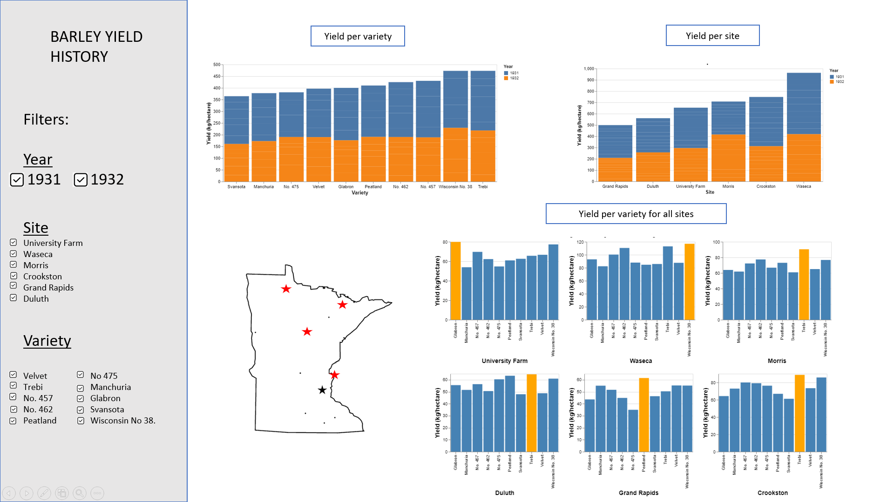
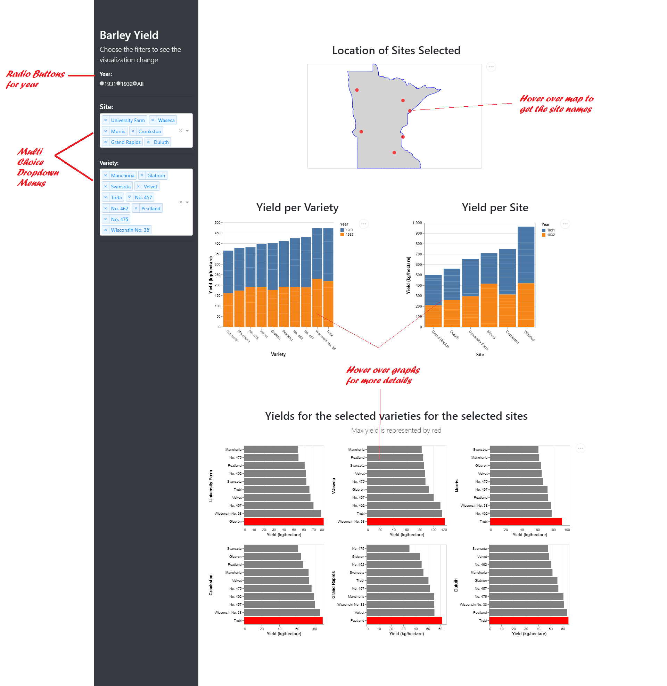

# DSCI_532_L02_group207_dashboards
Public Repository for Group 207

## Milestone I:

#### Description 

The app contains a landing page that displays the annual yield of barley for a range of varieties and sites in Minnesota for the years 1931 and 1932.  The user has an option to filter out variables from the annual yield distribution display, by the varieties of barley, by the sites, and finally by the year. There is also a map that will highlight the selected sites in Minnesota for which the yield is displayed. The first two graphs are comparing the yield vs variety and site respectively. The third graph highlights the variety that has the maximum yield for every site. Users will find the app helpful to compare the yield across multiple sites in Minnesota and decide which variety has the maximum yield through the app. 
 
 

## Milestone II:

###### [Barley App](https://barley-app.herokuapp.com/)
###### [Reflections](https://github.com/UBC-MDS/DSCI_532_L02_group207_dashboards/blob/master/REFLECTIONS.md)

#### App Description 

The app contains a landing page that displays the annual yield of barley for a range of varieties and sites in Minnesota for the years 1931 and 1932.  The user has an option to filter out variables from the annual yield distribution display, by the varieties of barley, by the sites, and finally by the year. There is also a map that will highlight the selected sites in Minnesota for which the yield is displayed. The first two graphs are comparing the yield vs variety and site respectively. The third graph highlights the variety that has the maximum yield for every site. Users will find the app helpful to compare the yield across multiple sites in Minnesota and decide which variety has the maximum yield through the app. 
 
 

 #### App Usage

Select the sites, the varieties and the year(s) on which you want to have some information. The app will automatically update.
The points on the map will represent the position of the different sites. You can use your mouse and put it over each point to see which site it represents. If you go down on the page, you'll see the 3 graphs described above. Each graph is interactive: you can zoom out on it to see the values more precisely. If you put your mouse over one bar of a graph, you'll see the site, the variety, the year and the yield corresponding to this bar. If you decided to select both years, the values of the yield displayed on the graph that represents the yields for the selected varieties for the selected sites is the sum of the yields of the two years.
  

